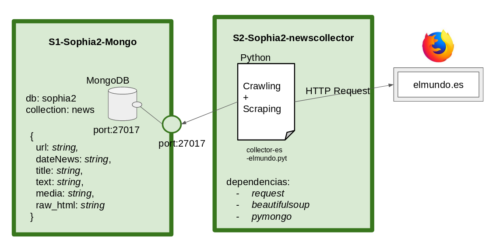

## Universidad Austral de Chile

# INFO229: Arquitectura de software

### Responsable: Matthieu Vernier, mvernier@inf.uach.cl

## PROYECTO SOPHIA2: una arquictura de software basada en microservicios para la recopilación y el análisis de noticias de prensa

La carpeta INFO229/Sophia2 contiene el código y la documentación asociado al proyecto transversal de la asignatura INFO229. 

### 1. Objetivo

El proyecto tiene como objetivo poner en práctica los procesos de diseño, integración y despliegue de arquitectura de software conversados en clase. 

### 2. Diseño inicial de Sophia2

Al inicio del semestre, la arquitectura de Sophia2 es muy sencilla. Está constituida por dos servicios:
1.  **s1-sophia2-mongodb**: este servicio levanta una instancia del SGBD no relacional MongoDB
2. **s2-sophia2-newscollector**: este servicio levanta un script python que se conecta a la pagina web del medio __elmundo.es__, recopila los enlaces de las últimas noticias, realiza un scraping de estas páginas e indexa datos en Mongo (url de la noticia, fecha, titulo, texto, medio y datos html brutos)

La arquitectura inicial puede representar con el esquema siguiente:




### 3. Proceso de despliegue de Sophia2

El proceso de despliegue está facilitado por el uso de las herramientas Docker y Docker-Compose. En su versión inicial, la carpeta INFO229/Sophia2/ se estructura así:

- **docker-compose.yml**: archivo de configuración que orquestra el levantamiento de los servicios y la comunicación entre los servicios.
- **s1-sophia2-mongodb**: carpeta asociada al microservicio 1
	- **Dockerfile**: archivo de configuración del microservicio, que levanta una instancia de Mongo.
- **s2-sophia2-newscollector**: carpeta asociada al microservicio 2
	- **Dockerfile**: archivo de configuración del microservicio, que levanta los scripts de recopilación de noticias de prensa.
	- **requirements.txt**: lista de dependencias/librerías que instalar antes de poder ejecutar el script.
	- **collector-es-elmundo.py**: script Python que recopila noticias de prensa a partir del sitio web __elmundo.es__

Una vez descargada la carpeta Sophia2, se puede levantar la arquitectura con los comandos ```docker-compose build``` y ```docker-compose up```.

### 4. Proceso de integración continua de Sophia2

TODO

### 5. Ejercicios

#### 5.1 Diseño

1. Proponer un diseño que permite recopilar noticias de al menos 2 medios dentro la lista de medios siguientes: El desconcierto, la nacion, Ciper, el ciudadano, la serena online, biobio, adnradio.
2. Proponer un diseño que permite asegurar la integridad de los datos (no se debe recopilar una noticia que tiene la misma URL que una noticia ya recopilada)
3. Proponer un diseño que permite monitorear y alertar rápidamente si algunas estrategías de crawling o scraping fallan.
4. Proponer un diseño que cuida la cantidad de consultas HTTP enviada a cada media. Debe autolimitarse y enviar una alerta cuando se acerca al limite.
5. Proponer un diseño que facilita los cambios y la integración de nuevas funcionalidades en la arquitectura.

#### 5.2 Despliegue

1. A partir de las modificaciones de diseño propuestas en el ejercicio anterior, implementar nuevos servicios que responden a al menos 2 puntos del ejercicio anterior. Modificar los archivos de configuración Docker y despliegar la nueva arquitectura en su computador local. 

