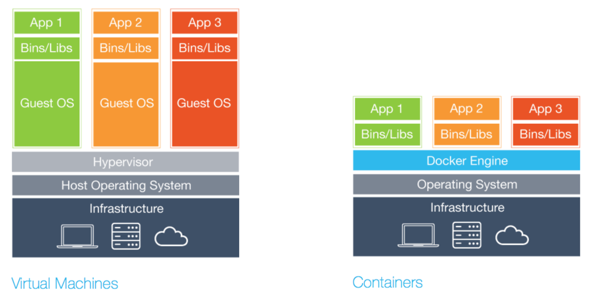

## Universidad Austral de Chile

# INFO229: Arquitectura de software

### Responsable: Matthieu Vernier, mvernier@inf.uach.cl

## TP1: Introducción al despliegue de software con Docker

Este tutorial es inspirado del tutorial de [Alexander Ryabtsev](https://djangostars.com/blog/what-is-docker-and-how-to-use-it-with-python/). Introduce los conceptos de contenedores Docker para facilitar el despliegue de arquitecturas de software en producción más frecuentes y rápidos. Al final de este artículo, podrán utilizar Docker en su máquina local y despliegar contenedores en un servidor remoto.

### ¿Qué es Docker y la integración por contenedores?

[Docker](https://www.docker.com/resources/what-container) corresponde a una herramienta de código abierto  que sirve para empaquetar, transportar y ejecutar softwares de distintos niveles de complejidad. Esta herramienta es un nuevo modelo de virtualización que se encarga de crear una capa de abstracción con el sistema operativo.

La idea principal de esta herramienta es crear contenedores portables para que las aplicaciones de software puedan ser ejecutadas en cualquier máquina que tenga Docker instalado, sin importar el sistema operativo que la máquina tenga instalado, facilitando enormemente los despliegues de aplicaciones.

Cuando se desarrolla una aplicación, se necesita proporcionar el código junto con todas las dependencias posibles como bibliotecas, el servidor web, bases de datos, etc. Es posible que se encuentre en una situación en la que la aplicación esté funcionando en su ordenador, pero que ni siquiera se inicie en el servidor de test o de producción.

Este desafío puede ser resuelto aislando la aplicación para que sea independiente del sistema.

### ¿En qué se diferencia de la virtualización?

Tradicionalmente, se utilizaban [máquinas virtuales](https://es.wikipedia.org/wiki/M%C3%A1quina_virtual) para evitar este comportamiento inesperado. El principal problema de la VM es que un "sistema operativo adicional" en la parte superior del sistema operativo del host añade gigabytes de espacio al proyecto. La mayoría de las veces su servidor alojará varias máquinas virtuales que ocuparán aún más espacio. Y por cierto, por el momento, la mayoría de los proveedores de servidores basados en la nube le cobrarán por ese espacio extra. Otro inconveniente significativo de la VM es un arranque lento.

Docker elimina todo lo anterior simplemente compartiendo el kernel del SO a través de todos los contenedores que se ejecutan como procesos separados del sistema operativo del host.



**NB**: El Instituto de Informática dispone de un servidor físico, dividido en máquinas virtuales. Utilizaremos una de esta máquina virtual para despliegar nuestros de contenedores Docker.

Docker no es la primera ni la única plataforma de contenedorización. Sin embargo, en la actualidad, Docker es el mayor y más poderoso actor del mercado.

### ¿Por qué se necesita a Docker?

La lista corta de beneficios incluye:

- **Proceso de desarrollo más rápido**

No hay necesidad de instalar aplicaciones de terceros como MySQL, Redis, Elasticsearch en el sistema - puede ejecutarlo en contenedores.

- **Práctica encapsulación de aplicaciones**

Usted puede entregar su arquitectura de software en una sola pieza. Docker ofrece un formato de imagen unificado para distribuir sus aplicaciones a través de diferentes sistemas host y servicios cloud. Puede entregar su aplicación en una sola pieza con todas las dependencias requeridas (incluidas en una imagen) listas para ser ejecutadas.


- **El mismo comportamiento en la máquina local / desarrollo / servidores de producción**

Reduce a casi cero la probabilidad de error causado por diferentes versiones de sistemas operativos, dependencias del sistema, etc.

Con el enfoque correcto para construir imágenes Docker, su aplicación utilizará la misma imagen base con la misma versión del sistema operativo y las dependencias necesarias.

- **Monitoreo fácil y claro**

Docker provee una manera unificada de leer los logs de todos los contenedores en ejecución. No necesita recordar todas las rutas específicas donde su aplicación y sus dependencias almacenan los archivos de logs.

- **Fácil de escalar**

Por diseño, Docker le obliga a seguir sus principios básicos, como la configuración sobre variables de entorno, la comunicación sobre puertos TCP/UDP, etc. Y si ha hecho bien su aplicación, estará lista para ser escalada y facilmente despliegable en cualquier servidor.

### Plataformas soportadas

La plataforma nativa de Docker es Linux, ya que se basa en las características proporcionadas por el núcleo de Linux. Sin embargo, todavía puede ejecutarlo en macOS y Windows. La única diferencia es que en macOS y Windows, Docker está encapsulado en una pequeña máquina virtual. Por el momento, Docker para macOS y Windows ha alcanzado un nivel significativo de usabilidad y se siente más como una aplicación nativa.

### Instalación

Puede consultar las instrucciones de instalación de Docker [aquí](https://docs.docker.com/install/).
Si está ejecutando Docker en Linux, necesita ejecutar todos los siguientes comandos como root o añadir su usuario al grupo de dockers y volver a iniciar sesión:

```
sudo usermod -aG docker username
```

**NB:** reemplazar username por su nombre de usuario


### Terminología

**Imagen** - Una descripción estática de la arquitectura de software que se quiere despliegar.

**Contenedor** - una instancia en ejecución que encapsula la arquitectura de software funcionando. Los contenedores siempre se crean a partir de imágenes. Un contenedor puede exponer puertos y volúmenes para interactuar con otros contenedores o con el mundo exterior. Los contenedores pueden ser fácilmente eliminados / removidos y recreados de nuevo en muy poco tiempo.

**Port (Puerto)** - un puerto TCP/UDP en su significado original. Corresponden a direcciones que sirven de punto de integración entre varios softwares. Los puertos pueden estar expuestos al mundo exterior (accesible desde el sistema operativo del host) o conectados a otros contenedores, es decir, accesibles sólo desde esos contenedores e invisibles para el mundo exterior. 

**Volumen** - puede ser descrito como una carpeta compartida dónde se almacenan los datos útiles. Los volúmenes se inicializan cuando se crea un contenedor. Los volúmenes están diseñados para datos persistentes, independientemente del ciclo de vida del contenedor.

**Docker Hub** - un servidor con interfaz web proporcionada por Docker Inc. Almacena muchas imágenes Docker con diferentes programas. Docker Hub es una fuente de imágenes "oficiales" de Docker realizadas por el equipo Docker o en cooperación con el fabricante original del software (no significa necesariamente que estas imágenes "originales" procedan de fabricantes oficiales de software). Las imágenes oficiales enumeran sus vulnerabilidades potenciales.

### Ejemplo 1: Hello World

Ejecutemos nuestro primer contenedor Docker:

```
docker run ubuntu /bin/echo 'Hello world' 
```

Salida de la consola:

```
Unable to find image 'ubuntu:latest' locally  
latest: Pulling from library/ubuntu  
6b98dfc16071: Pull complete  
4001a1209541: Pull complete  
6319fc68c576: Pull complete  
b24603670dc3: Pull complete  
97f170c87c6f: Pull complete  
Digest:sha256:5f4bdc3467537cbbe563e80db2c3ec95d548a9145d64453b06939c4592d67b6d  
Status: Downloaded newer image for ubuntu:latest  
Hello world  
```

- **docker run** es una orden para ejecutar un contenedor.
- **ubuntu** es la imagen que se ejecuta. Por ejemplo, la imagen del sistema operativo Ubuntu. Al especificar una imagen, el Docker busca primero la imagen en el host del Docker. Si la imagen no existe localmente, entonces la imagen se extrae del registro de imagen pública - Docker Hub.
- **/bin/echo 'Hello world'** es el comando que se ejecutará dentro de un nuevo contenedor. Este contenedor simplemente imprime "Hello world" y detiene la ejecución.

Creamos un shell interactivo dentro de un contenedor Docker:

```
docker run -i -t --rm ubuntu /bin/bash   
```

- **-t** crea un terminal dentro del contenedor
- **-i** le permite interactuar directamente con el terminal del contenedor
- El indicador **-rm** retira automáticamente el contenedor cuando el proceso sale. Por defecto, los contenedores no se eliminan. Este contenedor existe hasta que mantenemos la sesión shell y termina cuando salimos de la sesión (como una sesión SSH con un servidor remoto).

Si desea mantener el contenedor en funcionamiento después del final de la sesión, debe demonizarlo con el parametro **-d**:

```
docker run --name el_nombre_de_mi_contenedor -d ubuntu /bin/sh -c "while true; do echo hello world; sleep 1; done"  
```


- **-nombre** asigna el nombre del deamon a un nuevo contenedor. Si no especificas un nombre explícitamente, Docker lo generará y lo asignará automáticamente.
- **-d** ejecuta el contenedor en segundo plano (es decir, lo demoniza).

Veamos qué contenedores tenemos en este momento:

```
docker ps -a
```

Salida de la consola:

```
CONTAINER ID  IMAGE   COMMAND                 CREATED             STATUS                         PORTS  NAMES  
1fc8cee64ec2  ubuntu  "/bin/sh -c 'while..."  32 seconds ago      Up 30 seconds                         el_nombre_de_mi_contenedor
c006f1a02edf  ubuntu  "/bin/echo 'Hello ..."  About a minute ago  Exited (0) About a minute ago         gifted_nobel  
```

- **docker ps** es un comando para listar contenedores.
- **-a** muestra todos los contenedores (sin -a la bandera ps sólo mostrará los contenedores en ejecución).

El ps nos muestra que tenemos dos contenedores. No hay un segundo contenedor (el que tiene el terminal interactivo) porque hemos configurado la opción -rm. Como resultado, este contenedor se borra automáticamente inmediatamente después de la ejecución.

Revisemos los logs y veamos qué está haciendo el contenedor daemon ahora mismo:

```
docker logs -f el_nombre_de_mi_contenedor
```

Console output:

```
...
hello world  
hello world  
hello world 
```

Ahora detengamos el contenedor deamon:

```
docker stop el_nombre_de_mi_contenedor
```

Asegurarse que el contenedor se terminó:

```
docker ps -a
```

El contenedor está parado. Podemos iniciarlo de nuevo:

```
docker start daemon  
```

```
docker ps -a  
```

Salida del terminal:

```
CONTAINER ID  IMAGE   COMMAND                 CREATED        STATUS                    PORTS  NAMES  
1fc8cee64ec2  ubuntu  "/bin/sh -c 'while..."  5 minutes ago  Up 3 seconds                     daemon  
c006f1a02edf  ubuntu  "/bin/echo 'Hello ..."  6 minutes ago  Exited (0) 7 minutes ago         gifted_nobel  
```

Ahora, deténgalo de nuevo y retire todos los contenedores manualmente:

```
docker stop daemon  
docker rm <your first container name>  
docker rm daemon  
```

Para eliminar todos los contenedores, podemos usar el siguiente comando:

```
docker rm -f $(docker ps -aq)  
```

- **docker rm** es el comando para remover el contenedor.
- **-f** (para rm) detiene el contenedor si está en marcha (es decir, borrar por la fuerza).
- **-q** (para ps) es imprimir sólo los IDs del contenedor.

### Ejemplo 2: Variables de entorno y volumenes

Descargar el enlace siguiente: [link](docker-workshop-master.zip)

Descomprimir el archivo en su carpeta de trabajo y posicionarse en la carpeta **examples**

Es hora de crear y ejecutar un contenedor más relevante, como [Nginx](https://es.wikipedia.org/wiki/Nginx). NGinx es un servidor web de código abierto muy utilizado.

Cambiar el directorio a ejamples/nginx:


```
docker run -d --name "test-nginx" -p 8080:80 -v $(pwd):/usr/share/nginx/html:ro nginx:latest  
```

**Advertencia**: Este comando parece bastante pesado, pero es sólo un ejemplo para explicar volúmenes y variables env. En el 99% de los casos de la vida real, no iniciará los contenedores Docker manualmente, sino que utilizará servicios de orquestación (ilustraremos el uso de Docker-Compose en el ejemplo 4).

Salida de la consola:

```
Unable to find image 'nginx:latest' locally  
latest: Pulling from library/nginx  
683abbb4ea60: Pull complete  
a470862432e2: Pull complete  
977375e58a31: Pull complete  
Digest: sha256:a65beb8c90a08b22a9ff6a219c2f363e16c477b6d610da28fe9cba37c2c3a2ac  
Status: Downloaded newer image for nginx:latest  
afa095a8b81960241ee92ecb9aa689f78d201cff2469895674cec2c2acdcc61c 
```

-  **-p** es un mapeo de los puertos HOST PORT:CONTAINER PORT.
-  **-v** es un mapeo de los volumenes HOST DIRECTORY:CONTAINER DIRECTORY.

Importante: el comando sólo acepta rutas absolutas. En nuestro ejemplo, hemos usado $(pwd) para establecer la ruta absoluta del directorio actual.
Ahora compruebe esta url - 127.0.0.0.1:8080 en su navegador web.

Podemos intentar cambiar /ejemplo/nginx/index.html (que está montado como un volumen en el directorio /usr/share/nginx/html dentro del contenedor) y actualizar la página.

Obtengamos la información sobre el contenedor **test-nginx*:

```
docker inspect test-nginx  
```
  Este comando muestra información de todo el sistema sobre la instalación del Docker. Esta información incluye la versión del núcleo, el número de contenedores e imágenes, los puertos expuestos, los volúmenes montados, etc.


### Ejemplo 3: Escribir un Dockerfile

Para crear una imagen Docker, debe crear un archivo **Dockerfile**. Es un archivo de texto plano con instrucciones y argumentos. Aquí está la descripción de las instrucciones que vamos a usar en nuestro próximo ejemplo:

**FROM** - establece la imagen base
**RUN** - ejecuta el comando en el contenedor
**ENV** - fijar variable de entorno
**WORKDIR** - directorio de trabajo de sets
**VOLUME** - crea un punto de montaje para un volumen
**CMD** - set ejecutable para contenedor

Puede consultar la referencia de [Dockerfile](https://docs.docker.com/engine/reference/builder/) para obtener más detalles.

Vamos a crear una imagen que obtendrá el contenido del sitio web con el comando __curl__ y lo almacenará en un archivo de texto. Necesitamos pasar la URL del sitio web a través de la variable de entorno SITE_URL. El archivo resultante se colocará en un directorio, montado como un volumen.

Coloque el nombre de archivo Dockerfile en el directorio de ejemplos/curl con el siguiente contenido:

```
FROM ubuntu:latest  
RUN apt-get update   
    && apt-get install --no-install-recommends --no-install-suggests -y curl 
    && rm -rf /var/lib/apt/lists/*
ENV SITE_URL http://example.com/  
WORKDIR /data  
VOLUME /data  
CMD sh -c "curl -Lk $SITE_URL > /data/results"  
```

El archivo Dockerfile está listo. Es hora de construir la imagen real.

Vaya al directorio examples/curl y ejecute el siguiente comando para construir una imagen:

```
docker build . -t test-curl  
```

Salida del terminal:

```
Sending build context to Docker daemon  3.584kB  
Step 1/6 : FROM ubuntu:latest  
 ---> 113a43faa138
Step 2/6 : RUN apt-get update     && apt-get install --no-install-recommends --no-install-suggests -y curl     && rm -rf /var/lib/apt/lists/*  
 ---> Running in ccc047efe3c7
Get:1 http://archive.ubuntu.com/ubuntu bionic InRelease [242 kB]  
Get:2 http://security.ubuntu.com/ubuntu bionic-security InRelease [83.2 kB]  
...
Removing intermediate container ccc047efe3c7  
 ---> 8d10d8dd4e2d
Step 3/6 : ENV SITE_URL http://example.com/  
 ---> Running in 7688364ef33f
Removing intermediate container 7688364ef33f  
 ---> c71f04bdf39d
Step 4/6 : WORKDIR /data  
Removing intermediate container 96b1b6817779  
 ---> 1ee38cca19a5
Step 5/6 : VOLUME /data  
 ---> Running in ce2c3f68dbbb
Removing intermediate container ce2c3f68dbbb  
 ---> f499e78756be
Step 6/6 : CMD sh -c "curl -Lk $SITE_URL > /data/results"  
 ---> Running in 834589c1ac03
Removing intermediate container 834589c1ac03  
 ---> 4b79e12b5c1d
Successfully built 4b79e12b5c1d  
Successfully tagged test-curl:latest  

```

- **docker build** construye una nueva imagen localmente.
- **-t** establece la etiqueta de nombre en una imagen.

Ahora tenemos la nueva imagen, y podemos verla en la lista de imágenes existentes:

```
docker images  
```

Salida del terminal:

```
REPOSITORY  TAG     IMAGE ID      CREATED         SIZE  
test-curl   latest  5ebb2a65d771  37 minutes ago  180 MB  
nginx       latest  6b914bbcb89e  7 days ago      182 MB  
ubuntu      latest  0ef2e08ed3fa  8 days ago      130 MB  
```

Podemos crear y ejecutar el contenedor desde la imagen. Vamos a intentarlo con los parámetros por defecto:


```
docker run --rm -v $(pwd)/vol:/data/:rw test-curl  
```

Para ver los resultados en el archivo:

```
cat ./vol/results  
```

Probemos definiendo la variable de entorno, tomando un sitio real como ejemplo (por ejemplo Facebook.com):

```
docker run --rm -e SITE_URL=https://facebook.com/ -v $(pwd)/vol:/data/:rw test-curl   
```

Ver los resultados:

```
cat ./vol/results  
```

#### Algunas buenas prácticas para crear imágenes Docker:

- Eviten la instalación de paquetes innecesarios, ya que consumirá espacio de disco adicional.
- Tengan cuidado con los volúmenes. Deben recordar qué datos están en volúmenes. Debido a que los volúmenes son persistentes y no mueren con los contenedores, el siguiente contenedor utilizará datos del volumen creado por el contenedor anterior.
- Utilice variables de entorno (en RUN, EXPOSE, VOLUME). Esto hará que su Dockerfile sea más flexible.


#### Imágenes alpinas

Muchas de las imágenes Docker (versiones de imágenes) se crean sobre **Alpine Linux* - esta es una distribución ligera que le permite reducir el tamaño total de las imágenes Docker.

Le recomiendo que utilicen imágenes basadas en Alpine para servicios de terceros, como Redis, Postgres, etc. Para sus imágenes de aplicación, utilicen imágenes basadas en **buildpack** - será fácil de trabajar dentro del contenedor y tendrá muchos requisitos preinstalados en todo el sistema.

Sólo usted puede decidir qué imagen base utilizar, pero puede obtener el máximo beneficio utilizando una imagen básica para todas las imágenes, ya que en este caso la caché se utilizará de forma más eficaz.

### Ejemplo 4: Conecciones entre contenedores

**Docker compose** - es un software CLI utilizada para conectar contenedores entre sí.

Puede instalar docker-composite vía pip:

```
sudo pip install docker-compose  
```

En este ejemplo, vamos a conectar los contenedores Python y Redis.

```
version: '3.6'  
services:  
  app:
    build:
      context: ./app
    depends_on:
      - redis
    environment:
      - REDIS_HOST=redis
    ports:
      - "3001:5000"
  redis:
    image: redis:3.2-alpine
    volumes:
      - redis_data:/data
volumes:  
  redis_data:
```

Vayan a examples/compose y ejecute el siguiente comando:

```
docker-compose up  
```

El ejemplo actual incrementará la vista del contador en Redis. Abra la dirección 127.0.0.0.1:3001 en su navegador web y compruébelo.

Cómo usar docker-compose es un tema para un tutorial aparte. Para empezar, pueden jugar con algunas imágenes del Docker Hub. Si desean crear sus propias imágenes, sigan las mejores prácticas enumeradas anteriormente. 

Siempre deben dar nombres explícitos a sus volúmenes en docker-compose.yml (si la imagen tiene volúmenes). Esta sencilla regla les ahorrará un problema en el futuro cuando inspeccionen sus volúmenes.

```
version: '3.6'  
services:  
  ...
  redis:
    image: redis:3.2-alpine
    volumes:
      - redis_data:/data
volumes:  
  redis_data:
```

En este caso, redis_data será el nombre dentro del archivo docker-compose.yml.

Para ver los volúmenes, ejecuten:
  
```
docker volume ls 
```

Salida del terminal:

```
DRIVER              VOLUME NAME  
local               apptest_redis_data   
```

### Otras buenas prácticas con Docker

- 1 aplicación = 1 contenedor.
- Mantenga los datos fuera de los contenedores - use volúmenes.
- No utilice SSH (si necesita entrar en el contenedor, puede utilizar el comando docker exec).
- Evite las configuraciones (o acciones) manuales dentro del contenedor.

### Conclusión

Para resumir este tutorial, junto con IDE y Git, Docker se ha convertido en una herramienta de desarrollo imprescindible. Es una herramienta lista para la producción con una infraestructura rica y madura.

Docker puede utilizarse en todo tipo de proyectos, independientemente de su tamaño y complejidad. Al principio, puedes empezar con Docker-Compose. Cuando el proyecto crezca, puede migrar a servicios como Kubernetes.

Al igual que los contenedores estándar utilizados en el transporte de carga, la encapsulación de su código en contenedores Docker le ayudará a crear procesos de integración más rápidos y eficientes. Este  nuevo paradigma que ya está siendo utilizado en la arquitectura de grandes empresas como PayPal, Visa, Swisscom, General Electric, Splink, etc.


### Para ir más lejo:

- Despliegar su último contenedor en un servidor del Instituto de Informática, utilizando Docker y GitHub.
- Crear una imagen Docker para despliegar una aplicación web básica (con la librería Flask por ejemplo) que diga "Hola Mundo".
- Crear una imagen Docker para despliegar una aplicación web básica que se conecte a MySQL
